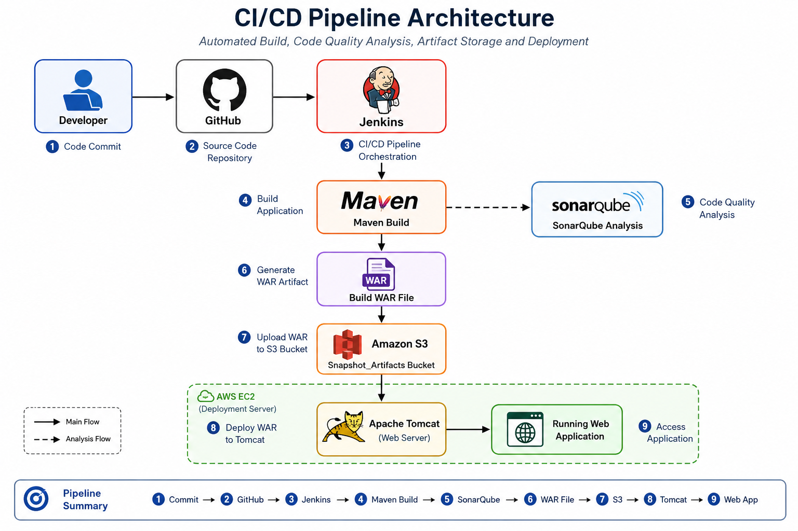
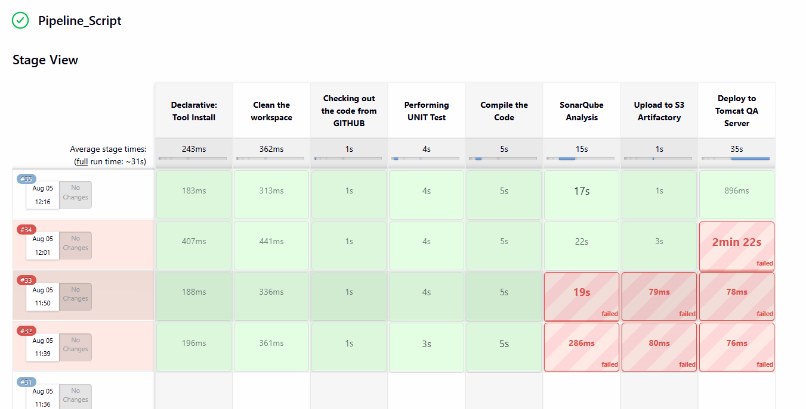
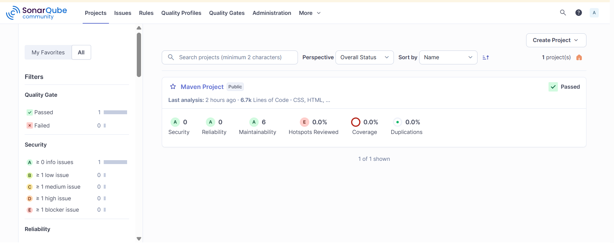
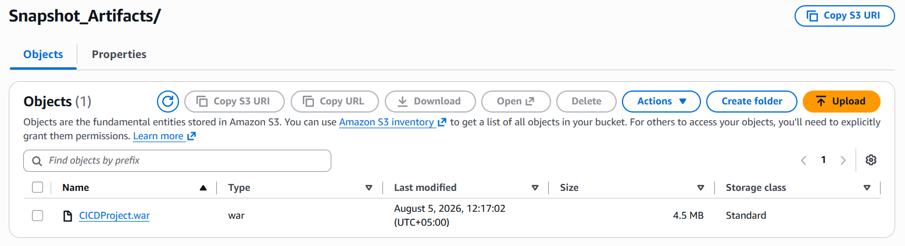

# CI/CD Pipeline Automation using Jenkins, SonarQube, AWS S3 & Apache Tomcat

## Project Overview

This project demonstrates a complete CI/CD pipeline for a Java Maven web application using Jenkins.

The pipeline automatically:

- Pulls source code from GitHub
- Performs Unit Testing
- Compiles the project
- Performs Static Code Analysis using SonarQube
- Uploads the WAR artifact to AWS S3
- Deploys the application to Apache Tomcat running on AWS EC2

---

## Project Architecture



## Technologies Used

- Java
- Maven
- Git
- GitHub
- Jenkins
- SonarQube
- AWS EC2
- AWS S3
- Apache Tomcat
- Linux (Ubuntu & Amazon Linux)

---

## Jenkins Pipeline Stages

1. Clean Workspace
2. Checkout Source Code
3. Perform Unit Test
4. Compile the Application
5. SonarQube Static Code Analysis
6. Upload Artifact to AWS S3
7. Deploy WAR File to Apache Tomcat

---

## AWS Services Used

- EC2
- S3
- IAM

---

## Repository Structure

```
First_Project/
│
├── images/
├── server/
│   ├── src/
│   └── pom.xml
├── webapp/
│   ├── src/
│   └── pom.xml
├── Jenkinsfile
├── pom.xml
└── README.md

```

## Author

Muhammad Ullah

Junior DevOps Engineer

GitHub:
https://github.com/DevopsEngineerMuhammad

---

# 📸 Project Screenshots

## Jenkins CI/CD Pipeline



---

## SonarQube Dashboard



---

## AWS S3 Artifact



---

## Apache Tomcat Deployment


